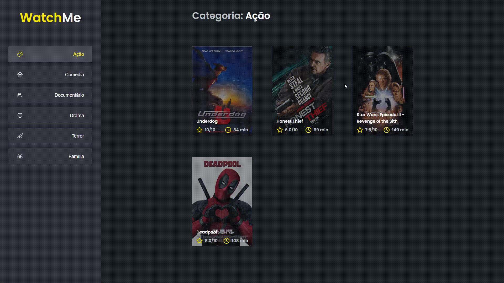

# Desafio 02 - Ignite (Rocketseat)

  

## Para testar o app localmente, siga os seguintes passos:

- Clonar o respositório (git clone)
- Instalar as dependências do projeto (yarn)
- Executar a fake API com json-server (yarn server)
- Executar o app (yarn dev)
- Acessar o app via navegador no endereço http://localhost:8080
